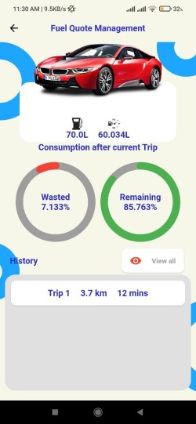

# VFCA - Vehicles Fuel Consumption Analysis

In order to control and analyze fuel consumption the VFCA works using three phases of operations as
shown in Fig 1. Phase 1 uses an AI model to predict your vehicle’s overall fuel consumption
according to the chosen features and metrics of the model. The prediction helps in phase 2 to
calculate the different vehicle trips exact fuel consumption and overall time and at the same time,
it considers choosing the shorter routes with fewer jams. Then to reduce the calculated fuel
consumption in phase 3, the driver’s behavior is analyzed using an AI model to predict if he is a
high, medium or low fuel consumer then gives the driver the tips to switch to the most efficient low
fuel consumption category. Then it provides effective solutions for the user of fuel recommendation
system and fuel quote management which proposes a way for tracking usage effectively and
conservation of money and the used fuel across daily vehicle trips.

## Application Features

- Fuel consumption detection with machine learning.
- Directions and time detection of trips.
- Fuel reduction recommendations using machine learning.
- Fuel quote management views.
- Single Trip consumption.

## Application ScreenShots:

### Quote View:

Quote View before model inference            |  Quote View after model inference
:-------------------------:|:-------------------------:
  |  

### Map (Direction and Time) View:

### Fuel Consumption View:

### Trip Consumption View:

### Quote Management View:

### Driver Behaviour Analysis:

Driver Behaviour Analysis aggressive class            |  Driver Behaviour Analysis normal class
:-------------------------:|:-------------------------:
  |  

## Expected Project Outcomes

The main outcome of this project is the local development of an efficient and flexible tool that can
be used to monitor and rationalize fuel consumption in vehicles. The following shows the specific
impacts that will be achieved as a result of the successful implementation of this project.

Building a solution that can save the consumer money which can reach up to as much as $1,000 (or
more) in fuel costs each year. Creating an environment-aware product that reduces environmental
impact by designing a fuel-efficient approach to eliminate Carbon dioxide (CO2) from burning
gasoline and diesel contributes to global climate change. Increasing energy sustainability as petrol
is a non-renewable resource, and we cannot sustain our current rate of use indefinitely. Using it
wisely now allows us time to find alternative technologies and fuels that will be more sustainable.
Our approach can reduce petrol dependence costs as the volume of crude petrol produced will
eventually begin to drop. 

## Important Notes:

- This project uses the Directions API, Maps SDK for android and IOS.
- inOrder for the Directions API to work a billing account on a GoogleAPI console is a must.

## Team Members and Contribution

Name            |  Contribution
:-------------------------:|:-------------------------:
Noor El-Deen Magdy |  Machine Learning Engineer
Abdulrahman Adel Ibrahim |  Machine Learning Engineer
Bassant Magdy |  Machine Learning Engineer
Ahmed Mohamed Zaki |  Mobile Developer
